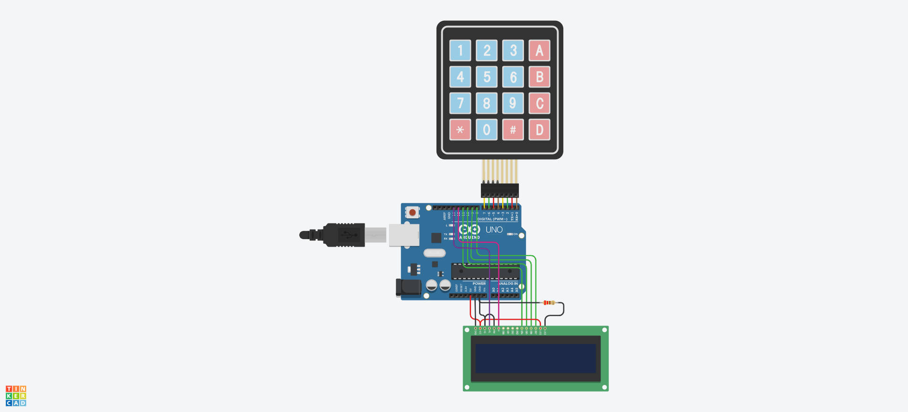
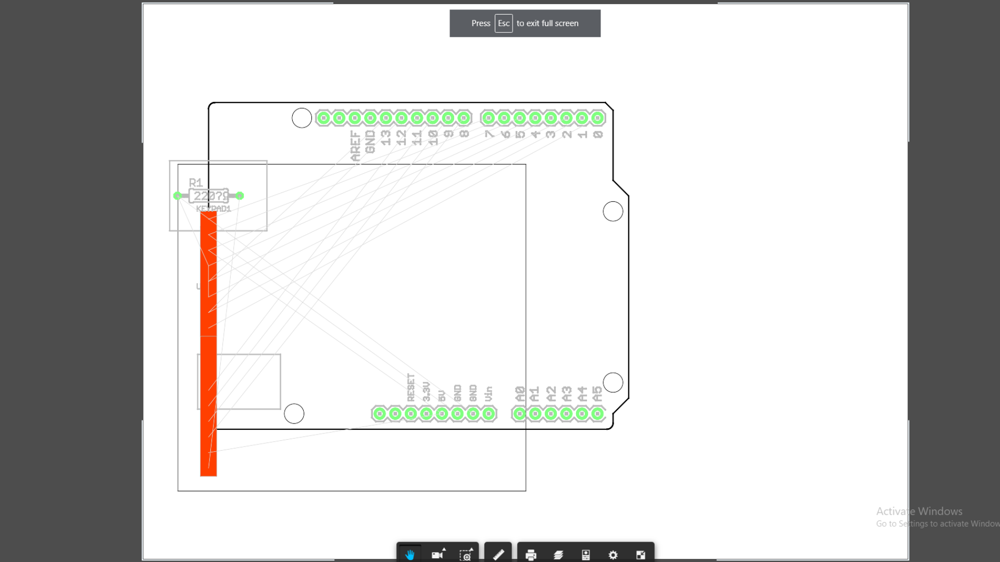

## Project description
Arduino Calculator is ready for using device and 3D printing model.

## Team(creators)
* Bakkeldi Orozbekov
* Tilek Sydykov
* Maksatbek Kanybek uulu
* Abdukarim Avazi

 TinkerCad Circuit.

Demonstration video is [here](https://www.youtube.com/watch?v=KFk2ueBfl3w).

# We used Eagle of AutoDesk to take PCB image.
The PCB and schematic tools were removed from Circuits on Tinkercad to focus gion making the simulator as easy to use as possible. 
We export eagle "brd" file from a Circuits design. So we can open our designs directly in Eagle
 PCB from Eagle for Tinkercad.
## Parts List 
| Amount | Part |
| ------ | ---- |
| 1      | LCD screen 16x2 |
| 2      | Arduino Uno R3 |
| 3      | Keypad 4x4 |
| 4      | 220 OM Resistor|

